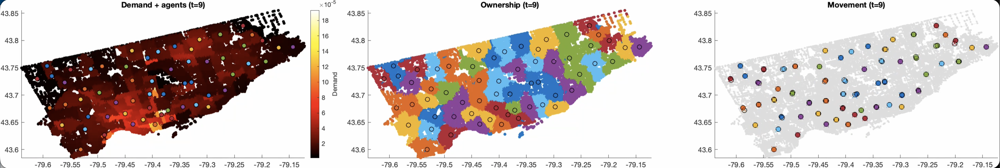

# Llyods MATLAB Simulation for APSC 200
Uses llyods algorithm to distrbute "idle taxis" (agents) across a node-graph object to minimize user wait time.

Rough code outline (in order of function calls):
* `initMap`: initializes a MATLAB graph object along with (x,y) coords for each node (nodes represent street intersections; we assume taxis are only hailed at intersections). It either generates a simple grid map or uses city of Toronto shapefile data (see data/README.md) to generate the map. `initMap` then assigns n agents randomly to the nodes of the graph. 
* `demandMap`: assigns a density value to each node. Either generates one for the grid map or uses city of toronto neighbourhood population data to generate one for the toronto map. 
* `voronoiRegions`: assigns each node to the closest agent (poor efficiency  - should deffinitley speed up at some point)  
* `centroidCalculator`: sums up the mass of each voroni region and computes their centroids (in R2)
* `moveAgents`: moves agents to the closest node of each centroid
* `plotter`: plots three graphs showing density, voroni assignments, and agents' next move
* `main`: runs everything, exports a .mp4 of the rendered simulation

*main future improvement*: when working with toronto data set didn't have super deep understanding; was tight on time so had partly generative code for toronto map/density map; dont trust results some of it looks wrong/overcomplicated; when I have more time I'd like to dive deeper into this data and learn shapefile/datastuff more deeply since main focus of this project was learning MATLAB + Llyods
fun future improvements: use traffic data to assign weightings to each edge, turn into actual simulation with taxis picking up users, taking them to destinations, and idle taxis redistribution around where active cars will be

